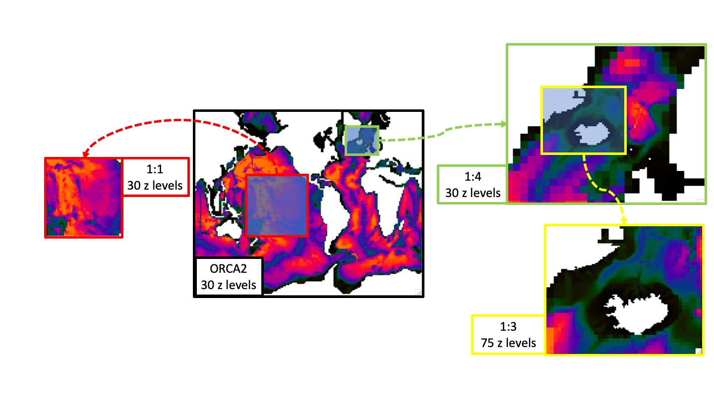

# Nemo Hackaton 2025, an AGRIF journey
<p align="center">
  
</p>

[AGRIF](https://agrif.imag.fr) (Adaptive Grid Refinement In Fortran) is a library that allows the seamless space and time refinement over rectangular regions in NEMO. Refinement factors can be odd or even (usually lower than 5 to maintain stability). Interaction between grids is “two-way” in the sense that the parent grid feeds the child grid open boundaries and the child grid provides volume/area weighted averages of prognostic variables once a given number of time steps are completed. This page provide guidelines for how to use AGRIF in NEMO. For a more technical description of the library itself, please refer to the [User's guide](https://agrif.imag.fr/agrifusersguide.html) [(pdf)](https://agrif.imag.fr/_downloads/agrifdoc_usersguide.pdf) or the [Reference manual](https://agrif.imag.fr/DoxygenGeneratedDoc/html/index.html) [(pdf)](https://agrif.imag.fr/_downloads/refman.pdf).

This README.md serves as an Table of Contents.

**Prerequisites:**
- [Install dependencies](chapters/Install_dependencies.md)
- [The safe way: use a Docker container](chapters/Docker.md)
- [Install NEMO v5.0](chapters/Install_NEMO.md)
- [Build test cases with SETTE](chapters/Sette.md)


 
 
 # AGRIF
 ## Defining the nesting hierarchy
When using AGRIF, the files correspondent to each nested model will be named with a prefix according to the hierarchy of the nesting. For this test case there is the global model with no prefix, and the subsequence of nested experiments are:
1= AGRIF domain nested in the global model with the same resolution as the parent (1:1 ratio).
2= AGRIF domain nested in the global model with a refinement of 4 (1:4)
3= AGRIF subdomain nested in model 2 with a refinement of 3 (1:3).
The nomenclature of each model namelists, configuration files, forcing fields need to follow this rule (e.g. `1_namelist_cfg`, `1_namelist_ref`, `1_domain_cfg.nc`, `1_data_1m_salinity_nomask.nc`, `1_context_nemo.xml`, ...). The same is expected for the ouptut files (e.g. `1_ocean.output`, `1_AGRIF_DEMO_LONG_5d_00010101_00010331_grid_T.nc, ...`).

For a general overview of AGRIF you can visit the [AGRIF user guide](https://sites.nemo-ocean.io/user-guide/zooms.html).

We can use the  `LONG` example available in AGRIF_DEMO to go through the required AGRIF specifications.

To run AGRIF you need a configuration file that will define the hierarchy of all the subdomains: `AGRIF_FixedGrids.in`. This file is necessary either to run your model, but also if you need to create the `domain_cfg.nc` files for your models, as will be explained later.
Bellow is how `AGRIF_FixedGrids.in` looks like in the test case example for AGRIF_DEMO:
```txt
2
45 85 52 94 1 1 1
121 146 113 133 4 4 4
0
1
20 60 27 60 3 3 3
0
```
The first line indicates the number of zooms in the parent larger domain (2). The following lines indicate the position of these nested domains in the parent grid (e.g. imin=45, imax=85, jmin=52, jmax=94). The last three values in these lines indicate the horizontal (rx and ry) and time (rt) refinement of each nested model (e.g. rx=4, ry=4, rt=4 for zoom 2). Please note that in this example zoom 1 has the same resolution as the parent, so in this case the refinement is always equals to 1. The following lines indicate the subsequent multiple nesting configuration, if there is. In the zoom 1 there is no embedded zoom domain, so it is 0. Inside zoom 2 there is a nested zoom 3, so we indicate 1 and the following lines follow the same rule as explained above.

If you wish to have a vertical refinement, like in this case for zoom 3, this is defined in `3_namelist_cfg` as:
```fortran
ln_vert_remap = .true. ! vertical remapping
 ```

## Creating the domain configuration files using `DOMAINcfg` tool:
Before compiling the tool, you will need to add the `key_agrif` to your cpp file:
```
/path/to/nemo-5.0.1/tools/DOMAINcfg/cpp_DOMAINcfg.fcm
```
After that you can compile the DOMAINcfg tool using this command:
```
./maketools -m [...] -n DOMAINcfg
```
Parent domain will be defined based on the specifications of the namelist, either by reading a configuration file (ln_read_cfg = .true.) or by defining manually in your namelist (e.g. ppglam0, ppgphi0).
Child domain will be defined based on `AGRIF_FixedGrids.in`, with respect to parent grid information.

The bathymetry for each of the grids will be computed based on the information you put in `nn_bathy`:
```
nn_bathy = 1  ! = 0 compute analyticaly
              ! = 1 read the bathymetry file
              ! = 2 compute from external bathymetry
              ! = 3 compute from parent (if "key_agrif")
```

For the option `nn_bathy = 1` the bathymetry needs to be already interpolated to the model grid. For the parent grid, if you provide a coordinates file (`ln_read_cfg = .true.`), longitude and latitude definitions will follow this file. If you set `ln_read_cfg = .false.`, the coordinates of the output `domain_cfg.nc` will follow the definitions in the `namelist_cfg`, where you define, for example, ilon and ilat (`ppglam0, ppgphi0`),  grid spacing (`ppe1_deg, ppe2_deg`), etc.
Be aware that when creating the child bathymetry, if you set `nn_bathy = 1`, the bathymetry you are reading need to match the exact domain size and position defined in the `AGRIF_FixedGrids.in`. The tool in this case will not consider the latitude and longitude of the bathymetry provided, but instead it will just overlap that region provided from the file to the domain specifications defined in `AGRIF_FixedGrids.in`.

The choice `nn_bathy = 2` will read a bathymetry file and interpolate it to the model grid. 

With `nn_bathy = 3` the tool will simply compute the bathymetry from the parent one, in the region defined in `AGRIF_FixedGrids.in`, without reading any external file. In this procedure, however, no interpolation is performed, and the parent bathymetry is just reshaped with more grid points.

This process is done also with a “lake-filling” algorithm that removes any small wet domains not connected to the zoom edges.

`rn_scale` is a multiplicative factor for negative (`rn_scale=-1`) or positive (`rn_scale=1`) bathymetry values in input file.

If you wish to have a vertical grid refinement, you can set `ln_vert_remap = .true.`, and define the vertical coordinates choices in the namelist.

For the case of two-way nesting, even if you already have a `domain_cfg.nc` file for your larger parent grid, when creating the child domains the tool will also compute a new domain file for the parent. The updated `domain_cfg.nc` includes some adjustments for consistency with AGRIF, ensuring compatibility between the parent and child grids. Such modifications occur only in the nested domain region, and can be adjustments in grid spacing, land-sea masks, or bathymetry corrections. Using the original `domain_cfg.nc` and not the one recreated is only possible in 1-way nesting.

The child domains will have extra layers of grid points surrounding the computational domain, called "ghost cells". These cells are necessary to apply boundary conditions and ensure the accuracy of time stepping and numerical schemes. In AGRIF, the number of ghost cells is set to 4 by default in the child grid, and one ghost cell is masked.
The parameter `npt_copy` refers to the width of the zone right inside the child grid, where the bathymetry is set to be equal to the parent one. This value is by default 4, to be coherent with the sponge zone used by the model.
The parameter `npt_connect` corresponds to the connecting zone right after the copy zone, where the child bathymetry is linearly interpolated to the parent one. It is set as 2 by default.