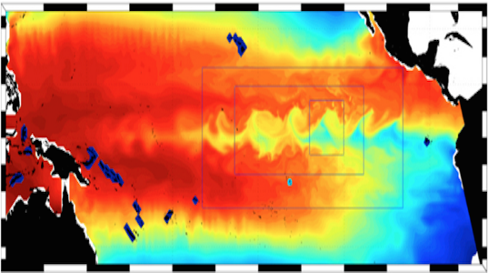

# Nemo Hackaton 2025, an AGRIF journey

  

[AGRIF](https://agrif.imag.fr) (Adaptive Grid Refinement In Fortran) is a library that allows the seamless space and time refinement over rectangular regions in NEMO. Refinement factors can be odd or even (usually lower than 5 to maintain stability). Interaction between grids is “two-way” in the sense that the parent grid feeds the child grid open boundaries and the child grid provides volume/area weighted averages of prognostic variables once a given number of time steps are completed. This page provide guidelines for how to use AGRIF in NEMO. For a more technical description of the library itself, please refer to the [User's guide](https://agrif.imag.fr/agrifusersguide.html) [(pdf)](https://agrif.imag.fr/_downloads/agrifdoc_usersguide.pdf) or the [Reference manual](https://agrif.imag.fr/DoxygenGeneratedDoc/html/index.html) [(pdf)](https://agrif.imag.fr/_downloads/refman.pdf).

This README.md serves as an Table of Contents.

**Table of content:**
- [Install dependencies](chapters/Install_dependencies.md)
- [Install NEMO v5.0](chapters/Install_NEMO.md)
- [Build test cases with SETTE](chapters/Sette.md)

 
 
 

When using AGRIF, the files correspondent to each nested model will be named with a prefix according to the hierarchy of the nesting. For this test case there is the global model with no prefix, and the subsequence of nested experiments are:
1= Agrif domain nested in the global model with the same horizontal and vertical resolution as the parent (1:1 ratio).
2= Agrif domain nested in the global model with a refinement of 4 (1:4)
3= Agrif subdomain nestes in model 2 with a refinement of 3.

The nomenclature of each model namelists, configuration file and forcing fields need to follow this rule (e.g. `1_namelist_cfg`, `1_namelist_ref`, `1_domain_cfg.nc`, `1_data_1m_salinity_nomask.nc`). The same is expected for the ouptut files (e.g. `1_ocean.output`, `1_AGRIF_DEMO_LONG_5d_00010101_00010331_grid_T.nc`).

The nested subdomain 3 has also a vertical refinement, which has to be activated in the 3_namelist_cfg:
ln_vert_remap   = .true. !  vertical remapping
 
Running the LONG test case for longer period:
To run agrif you need a configuration file that will define the hierarchy of all the agrif subdomains: AGRIF_FixedGrids.in
For the LONG test case we have a set of experiments
 
The example test case as it is set to run for a few time steps (nn_itend=16). In order to get more robust results for comparison between strategies, we can set the running period for longer.
If you wish to change the frequency of the output files you can also do so by editing the file_def_nemo-oce.xml. The default is 5d.
 
To enlarge the period of the simulation we need to update the nn_itend in the namelist. The current value is 16 for parent and child 1, 64 for child 2, and 192 for child 3.
For the parent model (namelist_cfg) and the first child model (1_namelist_cfg), the parameters are the same because there is no grid refinement and the time step is the same.
In the example in LONG, where we are running multiple nestings, you define the 2 in the top indicating that there will be 2 child subdomains in the ORCA2 parent model.
In the ORCA2 experiment, where we run just the global model separately without any nesting, the first parameter in the fixed grids is 0, which means no nesting.

